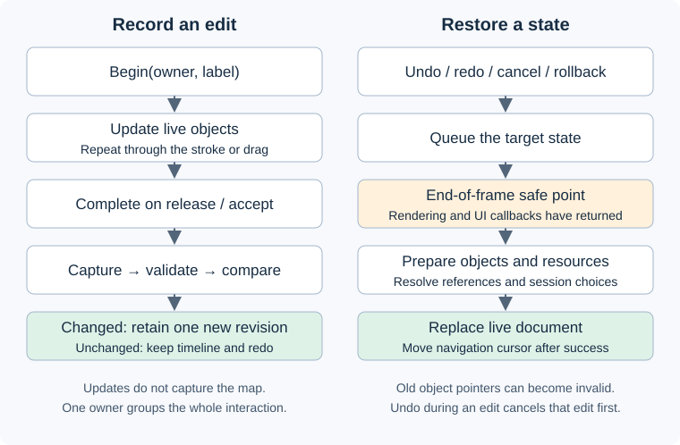
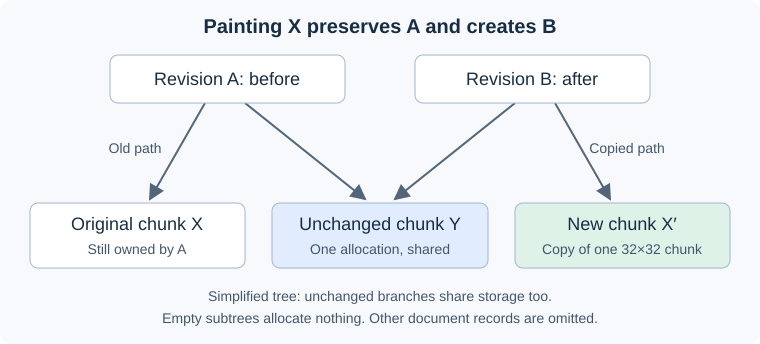

# Editor undo/redo: a contributor's guide

Every open map has **one chronological history**, shared by map, envelope and server-setting edits. An entry describes the document after one completed interaction. Undo restores an earlier document; redo restores a later one. Tools supply the interaction boundary, not an inverse operation.

Start with [one edit](#one-edit-from-start-to-finish), then choose an [extension recipe](#extending-the-editor). The [source map](#where-to-look) points to the implementation. No knowledge of the former history system is needed.

For a hands-on example, follow the [property-addition walkthrough](EDITOR_HISTORY_WALKTHROUGH.md). For method signatures, return values and interaction patterns, use the [recording API reference](EDITOR_HISTORY_API.md).

## What is recorded?

The editor separates three kinds of state:

| State | Examples | Where it belongs |
| --- | --- | --- |
| Document values | Tiles, quads, group properties, envelopes, settings, image/sound contents | `*Values` records in a document revision |
| Editor session | Selection, zoom, layer visibility/locking, tool choices | Runtime/session state; not an undo entry |
| Derived data | Texture/audio handles, rendering and fingerprint caches | Runtime objects; rebuilt or reused from document values |

A **revision root** is a `CEditorDocumentValues` containing the map's values and references to shared storage. Committed roots are immutable. Runtime objects such as `CLayerTiles` provide the editable values plus rendering/UI behavior. They may be replaced during undo, so their addresses are not lasting identities.

Objects have stable `m_Id` values; `CDocumentReference` stores an ID, not a vector index. IDs are allocated for the map's lifetime and never rewound by undo. Session choices are remembered separately by ID so a restored layer can retain its visibility/locking choices.

## One edit from start to finish



1. **Open or create a map.** `CEditorDocumentHistory::Initialize()` captures the initial document and creates its timeline. A loaded map establishes saved-content markers; a new map has no saved marker.
2. **Begin before changing values.** An interaction supplies an owner key and label. `Begin()` starts an edit or rejoins the same owner. Beginning a different owner completes the previous interaction. This does not capture the whole live map.
3. **Update live objects.** `Update(owner, callback)` runs the mutation. A stroke can call it hundreds of times; a drag can call it every frame. These updates remain one interaction. Helpers join the initiating owner.
4. **Complete once.** On release or acceptance, `CEditCoordinator::Complete()` calls `CEditorMap::CaptureDocument()`. Capture copies value records, reuses unchanged storage from the previous root and validates the candidate. `CRevisionHistory::Commit()` compares complete values. A no-op creates no entry and preserves redo. A changed result becomes a revision and removes the old redo branch.
5. **Undo, redo or cancel requests restoration.** These calls queue work. Undo during an unfinished edit cancels that edit first; it does not also traverse an older revision. Cancellation and failed completion restore the baseline without recording a new entry.
6. **Publish at a safe point.** After rendering/UI callbacks return, `CEditor::OnRender()` calls `FinishFrame()` and `PublishAtSafePoint()`. Restoration prepares replacement objects and resources, resolves references and selection, then replaces the live document. The timeline cursor moves only after restoration succeeds.

An **owner key** is an opaque pointer identifying the current interaction, usually a stable UI ID or tool address. It is not a document ID or an old property value. Do not use a temporary local's address for an interaction spanning frames. `Update` callbacks return `void`; do not let mutable references escape or keep object/element pointers across restoration. Resolve the object again from the current map when needed.

Capture/validation failures leave the retained revision unchanged and request rollback. Failed undo navigation can be dismissed; failed cancellation/rollback stays pending and blocks new edits until recovery. Tools should respect false return values instead of mutating anyway.

### A single command

This is the pattern used by `CEditor::AddGroup()` in [quick_actions.cpp](../../src/game/editor/quick_actions.cpp):

```cpp
Map()->m_DocumentHistory.Edit(this, "Add group", editor_history::ECategory::MAP, [&] {
	Map()->NewGroup();
	Map()->m_SelectedGroup = Map()->m_vpGroups.size() - 1;
});
```

`Edit()` combines begin, update and completion. Its successful `bool` also includes an unchanged result. It is for a whole command: calling it inside another edit does not join that edit. A helper should mutate within the caller's callback, or call `Update()` with the same owner.

### A property control, stroke or drag

Existing property panels use `DoPropertiesWithState()` and `BeginControl()`/`EndControl()` to group both dragging and text entry. Adding a property to such a panel normally uses its existing transaction. This shortened example follows the sound-radius control in [popups.cpp](../../src/game/editor/popups.cpp); its property definitions, IDs and selected source are supplied by that panel:

```cpp
auto [State, Prop] = pEditor->DoPropertiesWithState<ECircleShapeProp>(
	&View, aCircleProps, s_aCircleIds, &NewVal);
auto &History = pEditor->Map()->m_DocumentHistory;
if(History.BeginControl(s_aCircleIds, "Edit source radius", State))
{
	History.Update(s_aCircleIds, [&] {
		if(Prop == ECircleShapeProp::CIRCLE_RADIUS)
			pSource->m_Shape.m_Circle.m_Radius = NewVal;
	});
	History.EndControl(s_aCircleIds, State);
}
```

`NONE` does nothing, `CANCELLED` requests cancellation, and `END`/`ONE_GO` complete. `DoPropertiesWithState()` also calls `TouchControl()` every frame, even when no value changes. A custom control must provide equivalent presence tracking, or `FinishFrame()` cancels an owner that disappeared.

For **document strings**, use `DoDocumentEditBox()` with a persistent `CLineInput` bound to the current object's buffer. The group-name control uses:

```cpp
auto pGroup = pEditor->Map()->SelectedGroup();
static CLineInput s_NameInput;
s_NameInput.SetBuffer(pGroup->m_aName, sizeof(pGroup->m_aName));
if(pEditor->DoDocumentEditBox(&s_NameInput, &Button, 10.0f, "Rename group"))
	pEditor->Map()->OnModify();
```

The adapter in [editor_ui.cpp](../../src/game/editor/editor_ui.cpp) establishes ownership; `OnInput()` routes text changes through it. `FinishDocumentText()` accepts on Enter/valid blur or cancels on Escape/owner disappearance. Render the adapter every frame and rebind to the current buffer; ordinary `DoEditBox()` does not supply this document lifecycle.

For a canvas gesture, use `Begin → Update... → Complete(POINTER_RELEASE)`. Call `TrackPointer()` with the active UI capture item so losing capture cancels the edit; complete **before** clearing that item. `CEditor::DoSoundSource()` in [editor.cpp](../../src/game/editor/editor.cpp) is a working example. `EditRepeated()` groups repeated key presses until `KeyReleased()`. Never complete on every drag frame or tile stamp.

`OnModify()` updates modification timing/presentation; it does **not** record an edit. Keep existing notification calls where appropriate, but wrapping the mutation in an edit is what makes it undoable.

## Why snapshots do not mean copying the whole map



The system retains complete logical states with **structural sharing**: multiple revisions point to the same unchanged allocation. It does not serialize a map on every edit or replay a chain of binary patches.

Tiles use a sparse persistent tree. `CEditorTilePlane` uses 32×32 chunks; a write copies only shared nodes along the affected path and the affected chunk. Empty subtrees need no allocation. Each retained root still describes the entire plane. Generic restoration needs neither a “paint” action class nor instructions to reverse a stroke.

Group/layer/envelope records and their collection containers can share storage. Image/sound blobs retain immutable bytes, making redo independent of files subsequently changing on disk. `CSharedValue` compares values, with a fast path for shared ownership. `CSharedVector` copies the **whole vector** when detached; its elements may themselves share records.

This is not field-level reflection or constant-time capture. Settings, quads, sound sources and envelope points are ordinary vectors: capture can copy/compare them before reusing an unchanged record, and a changed record can retain a whole element vector. Very large new collections need a deliberate storage choice and measurements.

The design trades explicit inverse commands and property trackers for a common value model and restoration path. Copying live C++ objects would also copy UI pointers and resource handles; saving/loading on every edit would lose authoring-only values and add export work. Values plus shared storage avoid both problems. Stable IDs allow collection reordering and wrapper replacement without making references depend on addresses.

### Retention and memory figures

History limits count entries and the union of retained allocations. Fifty undo entries normally need 51 roots, including the baseline. Shared allocations count once, not once per revision. Trimming protects the current state and its immediate predecessor; the byte limit is soft when these cannot fit. Lowering limits while undone also preserves the entire redo suffix, trimming only the older prefix; both targets can remain exceeded. A large edit remains undoable.

Detailed live/draft/save/cache figures refresh automatically after invalidation when diagnostics are requested. Main-thread observation records allocation identities/capacities and pins immutable owners; a coalesced worker calculates totals. Stale results are discarded. This avoids a synchronous full scan on every live update. Categories can overlap; do not add them as if independent. These are owned payload/capacity figures, excluding allocator/control-block and accounting bookkeeping overhead, not OS resident memory or private commit.

## Saving while editing

`SaveWithKind()` settles a manual edit before pinning the current immutable revision. Autosave defers while an interaction or publication is pending. A save job owns that captured root while a worker exports, compresses, writes and replaces the file. Further edits can proceed against other values. Export jobs are ordered and serialized to bound temporary buffers; completing a write still takes time.

`ExportEditorDocument()` is the common **file projection**: it converts document values into the native `.map` representation. Both the writer and persisted-content fingerprint use it. History equality includes all authoring values; the fingerprint includes what is exported. Thus a completed authoring-only edit can be undoable without changing saved-file dirtiness. During any active edit, including a no-op, the editor conservatively reports dirty; the settled state uses the persisted key.

Only successful manual/autosave completion updates its marker, tied to the original map lifetime and captured contents. Finishing an older save does not mark newer edits clean. Manual-save and autosave markers are separate; autosave does not clear the manual unsaved indicator. **Save Copy** updates neither marker nor the map's filename. GPU/audio objects and session state never enter the worker's export input.

## Extending the editor

### 1. Add a property to an existing object

1. Decide whether it is document, session or derived state using the first table. Put an undoable property in the relevant record in [document_values.h](../../src/game/editor/mapitems/document_values.h), [element_values.h](../../src/game/editor/mapitems/element_values.h) or [tile_values.h](../../src/game/editor/mapitems/tile_values.h), with an initialized default.
2. Ensure semantic equality includes it. A scalar added to a record with `operator== = default` already participates. Records with custom comparisons/conversions need an explicit check. Adding a field only to a runtime wrapper or native `CMapItem*`/`CQuad` structure is insufficient.
3. Mutate it inside the existing property edit, or use the patterns above. Current whole-record capture/restore assignments include the field; no undo action, tracker or field-by-field restore setter is needed. Tile-cell changes also need the specialized checks below.
4. If it must survive save/reload, update import in [map_io.cpp](../../src/game/editor/mapitems/map_io.cpp) and the projection in [document_export.cpp](../../src/game/editor/mapitems/document_export.cpp), preserving format compatibility/defaults. The fingerprint follows that projection. Add validation for real invariants and rebuild/invalidate derived data if the new property affects it.
5. Check edit/undo/redo, cancel and a no-op. For a saved property, also check save/reload and dirty-state transitions. For an authoring-only property, verify the persisted key stays unchanged.

For example, adding `int m_MyProperty = 0;` to `CLayerGroupValues` covers copy/equality/history automatically. It does not add a file-format field. The [extension exercise](../../scripts/editor_history_tools/extension_test.inc) injects such a field into a separate source copy and checks undo/redo, 200-update cancellation and no-op/redo behavior without changing capture, restore or history code.

The [walkthrough](EDITOR_HISTORY_WALKTHROUGH.md) takes this from the value declaration through the property panel, control grouping and verification.

### 2. Add an instance of a supported map item

Use the existing creation path (`NewGroup`, `CLayerQuads::NewQuad`, `CLayerSounds::NewSource`, etc.) within one edit. Those paths allocate fresh stable IDs. Duplication/paste must assign fresh IDs to copied identified objects too. Existing graph loops already handle additional instances of supported types.

References must point to the intended IDs, not saved vector positions. Deleting an item must maintain valid references within the same edit. Test create/delete/duplicate, undo/redo, and any reorder or resource-remapping behavior. Do not allocate a new identity when merely restoring an existing object.

### 3. Add a new kind of map item or layer

This requires explicit integration; there is no automatic type registry. Follow the nearest existing kind through this checklist:

| Integration | What to add or check |
| --- | --- |
| Values and graph | An authoritative record; the applicable variant or root collection in `document_graph.h` |
| Capture | Runtime-to-values branch in `CaptureDocument()`; reuse unchanged records where appropriate |
| Validation | Unique IDs, valid references, payload/type agreement and the kind's invariants in `Validate()` |
| Restore | Preparation, value assignment, identity reservation, references and runtime resources in `RestoreDocumentAtSafePoint()` |
| Storage | Retained accounting, live traversal and worker-safe observation described below |
| Persistence | Native format/version/defaults, load and export; fingerprint cache dependencies |
| Editor behavior | Normal rendering/selection/creation/deletion; session capture/apply if choices must survive wrapper replacement |

Here “new map item” can mean a new object kind, or only a new serialized `CMapItem*`. For a serialized item representing existing values, change import/export and format compatibility; a new history variant is needed only when the document model gains a new kind. Neither case needs an inverse action class.

### Fields needing extra care

- **Heap storage:** use independently owned values (`std::vector`), copy-on-write (`CSharedValue`/`CSharedVector`) or immutable ownership. An ordinary mutable `shared_ptr` can let live edits change old revisions; accounting does not fix ownership. Extend `CEditorDocumentValues::Account()` and `CEditorMap::VisitLiveStorage()`. Check `ObserveStorage()` too: it explicitly selects root fields to observe, so changing `Account()` alone is insufficient for a new top-level field. Observe raw allocation identities/capacities on the main thread and pin immutable owners; never capture mutable runtime pointers for worker traversal. Recurse into shared children only when `Account()`/`CStorageUsage::Add()` returns true: this matters for both adding and removing roots.
- **Resources:** own immutable bytes in `CResourceBlob`; keep texture/audio handles outside revisions. Account nested allocations and any new runtime caches.
- **References:** use `CDocumentReference`, validate its target and extend the appropriate `VisitImageReferences`, `VisitSoundReferences` or `VisitEnvelopeReferences` visitor on the layer/group. Export resolves IDs to native indices. If cached output depends on another object's order/content, include that dependency in cache invalidation; envelope ordering is an existing example.
- **Tile data:** use `CEditorTilePlane::Set/Update`, not a dense side buffer. Check defaults, equality, normalization and native conversion in `tile_values.h`. Its AMD64 packed importer assumes `CTileValues` is two bytes with fixed offsets: update or disable that specialization when changing the layout. A new tile type also needs graph/restore branches, `CEditorTilePayload`, `CTileFormat` and the fingerprint plane variant in `document_export.*`. Chunk accounting covers `sizeof` cells, not hidden heap allocations inside a new cell type.
- **Session choices:** extend `document_session.h` and `CaptureLayerSession`/`ApplyLayerSession` where applicable; do not put view/tool choices into undoable values just to preserve them across restore.

## Where to look

Paths below start at `src/game/editor/` unless noted. Follow the first five rows to trace a command through undo.

| Responsibility | Source |
| --- | --- |
| Tool-facing API and control grouping | [history/document_history.h](../../src/game/editor/history/document_history.h), [.cpp](../../src/game/editor/history/document_history.cpp) |
| Interaction ownership and deferred rollback | [history/edit_coordinator.h](../../src/game/editor/history/edit_coordinator.h) |
| Capture, graph validation/accounting | [mapitems/document_graph.cpp](../../src/game/editor/mapitems/document_graph.cpp), [.h](../../src/game/editor/mapitems/document_graph.h) |
| Revision list, commit, cursor and trimming | [history/revision_history.h](../../src/game/editor/history/revision_history.h) |
| Runtime restoration and session reconciliation | [mapitems/document_restore.cpp](../../src/game/editor/mapitems/document_restore.cpp) |
| Shared values, tiles, immutable resources | [history/shared_value.h](../../src/game/editor/history/shared_value.h), [tile_plane.h](../../src/game/editor/history/tile_plane.h), [resource_blob.h](../../src/game/editor/history/resource_blob.h) |
| Save request, worker, saved-content markers | [mapitems/map_io.cpp](../../src/game/editor/mapitems/map_io.cpp), [history/save_job.cpp](../../src/game/editor/history/save_job.cpp), [save_state.h](../../src/game/editor/history/save_state.h) |
| File projection and fingerprint caches | [mapitems/document_export.cpp](../../src/game/editor/mapitems/document_export.cpp) |
| Core and actual-editor regression tests | [src/test/editor_history.cpp](../../src/test/editor_history.cpp), [src/test/editor_runtime/history.cpp](../../src/test/editor_runtime/history.cpp) |

Add tests near the matching existing case. For a new interaction, exercise many updates producing one entry, no-op preserving redo, cancellation/capture loss, and undo during an active gesture. New storage should compare observed totals against fresh accounting; new references should survive restore/reorder/deletion. Use the project's normal `run_tests` target and the headless `run_editor_tests` target for actual-editor fixtures. The [verification tools](../../scripts/editor_history_tools/README.md) explain isolated builds, the extension exercise and large-map protocols.

## Performance: evidence and limits

The original v2 implementation exposed costly full-plane work. Persistent tiles, incremental storage accounting and fingerprint caching removed those scans from sparse edits. Background export moved save preparation/compression off the UI thread. Rendering now reads bounded chunk-row spans with a small borrowed cursor cache, without retaining a dense render mirror; derived opacity handling also preserves authored tile orientations.

These are **recorded measurements from successive corrections**, not a fresh run for this guide. Two Springlobe 4 variants contain about 257 million base cells each. Comparisons use matched MSVC 19.44 x64 configurations; “optimized” means RelWithDebInfo. The table below summarizes the measured tradeoffs; use the verification tools linked at the end of this section to collect evidence for your checkout. Original raw logs and binaries are not distributed.

| Workload and correction stage | Before | After |
| --- | ---: | ---: |
| Massive-map correction: optimized headless load + first frame, variant 354, median | 2.179 s (pre-v2) | 2.391 s |
| Same stage: optimized complete edit/undo/redo + frame, worst pooled p95 | 0.611 ms (pre-v2) | 2.252 ms |
| Same stage: steady headless private memory | ~1.25–1.27 GB (pre-v2) | ~222–248 MB |
| Background-save correction: optimized foreground enqueue, maximum | 988.22 ms (previous correction) | 0.0604 ms |
| Final rendering: native zoom 900, 354 optimized idle-frame p95 | 35.610 ms (pre-v2) | 9.397 ms |
| Same view: worst edit/traversal frame p95 | 31.501 ms (pre-v2) | 12.034 ms |

Read the table with these limits:

- Sparse edits still have measurable capture/history overhead; the massive-map Debug load correction remained roughly 1.2 seconds slower than pre-v2. In the final native zoom-200 comparison, worst Debug phase p95 increased from 8.748 to 16.826 ms. A shared snapshot is not free.
- Save enqueue time is not disk completion time: optimized background writes still took about 3.82–3.99 seconds. Headless save/edit figures exclude native GPU/audio work.
- Native frame measurements used a hidden 1920×1080 OpenGL window, engine render-thread synchronization and no explicit GPU fence. Background applications remained active. These are frame-time distributions, not a guarantee of focused-window FPS or a maximum-frame bound. Both variants matched pre-v2 pixels at zoom 100/900 on atlas and texture-array paths.
- Wide views remain costly: at zoom 2000, corrected worst-phase p95 was 151.529 ms Debug / 43.169 ms optimized, with a 330.918 ms Debug maximum.
- The strict native private-memory ceiling did **not** pass every run: one 354 Debug run peaked at 1.064 GB private commit after zoom 2000, with 496 MB resident memory. Its repeat stayed below 1 GB private. Private commit and resident memory differ; the extra native commitment is not yet isolated. Do not generalize the earlier headless memory result to all graphics workloads.

Use the [matched history probes](../../scripts/editor_history_tools/matched/README.md), [save protocol](../../scripts/editor_history_tools/README.md#save-responsiveness) and [native rendering protocol](../../scripts/editor_history_tools/rendering/README.md) when changing these paths. Compare the same map, build configuration, view, retained history and backend; preserve slow samples as well as fast ones.
